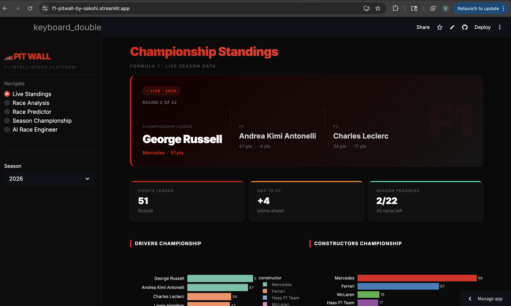
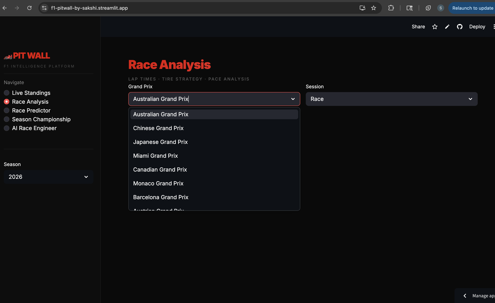
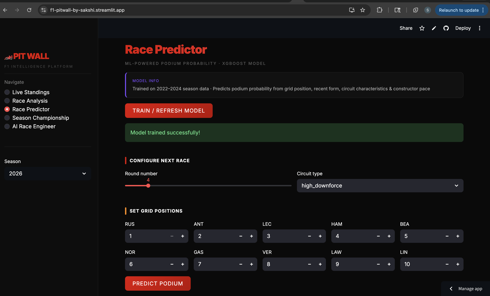
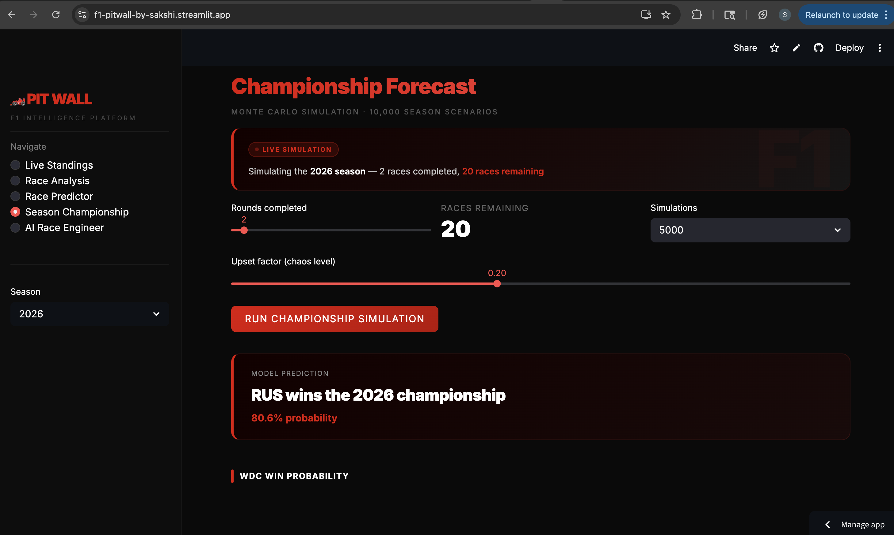
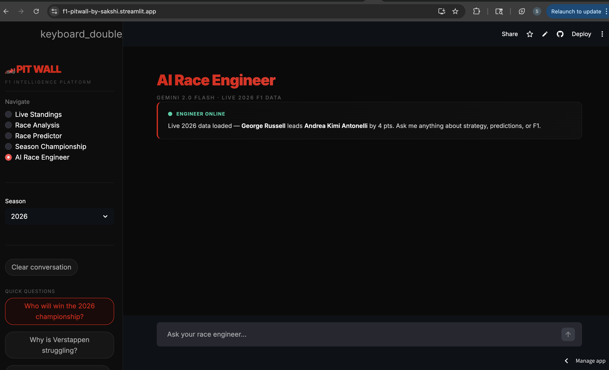
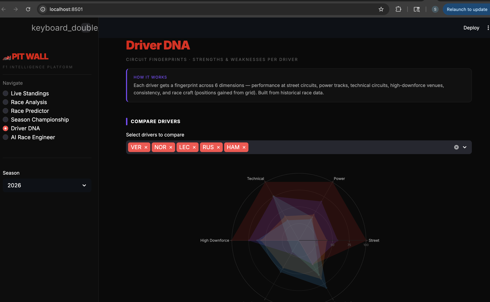
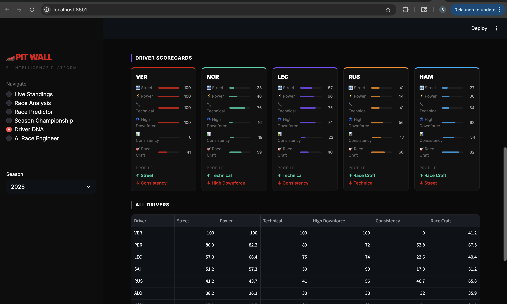
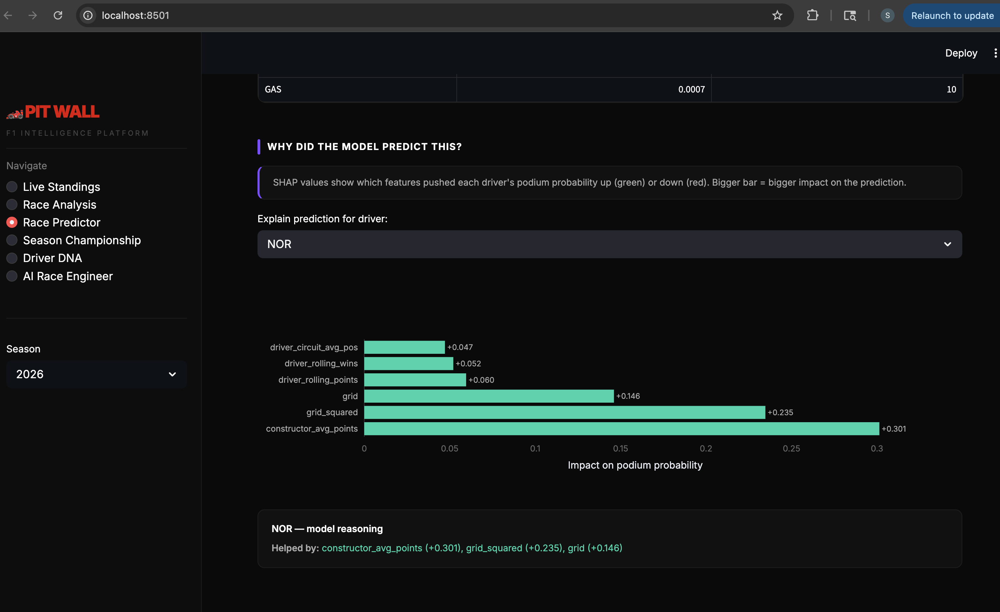

# 🏎️ Pit Wall - F1 Intelligence Platform

> A full-stack AI-powered Formula 1 intelligence platform with live 2026 season data, ML race predictions, Monte Carlo championship simulation, and an AI Race Engineer chatbot.

**[Live Demo → f1-pitwall-by-sakshi.streamlit.app](https://f1-pitwall-by-sakshi.streamlit.app)**

---

## Screenshots

### Live Championship Standings

*Real-time 2026 F1 championship — George Russell leads Antonelli after Round 2*

### Race Analysis

*Lap time evolution & tire strategy visualisation powered by FastF1*

### Race Predictor

*XGBoost model predicting podium probabilities — 90.7% accuracy*

### Season Championship Forecast

*Monte Carlo simulation — 10,000 season scenarios, RUS predicted 2026 champion*

### AI Race Engineer

*Gemini 2.0 Flash chatbot with live 2026 F1 context*

### Driver DNA — Circuit Fingerprints

*Radar chart comparing driver strengths across 6 dimensions*

### Driver Scorecards

*Individual driver scorecards with mini progress bars per circuit type*

### SHAP Explainability

*Model reasoning — which features drove each podium prediction*
---

## What is Pit Wall?

Pit Wall is a personal F1 data science project that goes beyond typical portfolio dashboards. It ingests **live 2026 F1 season data**, runs real ML models, and lets you talk to an AI that knows the current championship standings. Built entirely in Python, deployed on Streamlit Cloud.

The app updates automatically as the 2026 season progresses — standings, race results, and championship predictions all reflect real data.

---

## Features

### Live Championship Standings
- Real-time 2026 F1 driver & constructor standings
- Hero dashboard showing P1/P2/P3 with points gaps
- Full season schedule with race dates and circuits
- Works for 2022–2026 seasons

### Race Analysis
- Lap time evolution charts for any race session
- Tire strategy visualisation (compound per driver per lap)
- Fastest lap stats and race results
- Powered by FastF1 API with local caching

### Race Predictor (ML)
- XGBoost model trained on 2022–2024 season data
- Predicts podium probability per driver
- Features: grid position, rolling form, circuit type, constructor pace, DNF rate
- **90.7% accuracy** on held-out test data

### Season Championship Forecast
- Monte Carlo simulation — 10,000 season scenarios
- Predicts WDC & WCC winner probabilities based on current standings
- Adjustable upset factor to model chaos/reliability
- Current vs projected final points comparison

### AI Race Engineer
- Powered by Google Gemini 2.0 Flash
- Loaded with live 2026 standings as context
- Ask anything: strategy calls, driver comparisons, championship analysis
- Suggested questions + free-form chat interface

### Driver DNA
- Radar chart comparing drivers across 6 dimensions
- Street, Power, Technical, High Downforce, Consistency, Race Craft
- Individual scorecards with strength/weakness profile
- Built from 2022-2024 historical race data

### SHAP Explainability
- Explains exactly why the model predicted each driver's podium probability
- Shows top positive and negative factors per driver
- Plain language reasoning card — "Helped by constructor pace, grid position"

---

## Tech Stack

| Layer | Technology |
|---|---|
| Data ingestion | FastF1, OpenF1 API, Jolpica (Ergast replacement) |
| ML models | XGBoost, scikit-learn |
| Simulation | NumPy Monte Carlo |
| Backend | Python, pandas |
| Frontend | Streamlit, Plotly |
| AI | Google Gemini 2.0 Flash |
| Deployment | Streamlit Cloud |

---

## ML Model Details

**Race Podium Predictor (XGBoost)**
- Target: binary podium classification (top 3 finish)
- Training data: 2022–2024 seasons (~300 race entries)
- Test accuracy: **90.7%**
- Key features: grid position, 5-race rolling points average, 10-race win/podium rate, circuit type encoding, constructor avg points, DNF rate

**Season Championship Simulator**
- Monte Carlo approach: 10,000 simulated seasons
- Driver strength derived from current points standings
- Gaussian noise injection for realistic unpredictability
- Updates after every round with fresh standings

---

## Project Structure
```
pit-wall/
├── app/
│   ├── data/
│   │   ├── fastf1_client.py       # FastF1 telemetry & lap data
│   │   └── ergast_client.py       # Standings & schedule (Jolpica API)
│   ├── models/
│   │   ├── feature_engineering.py # ML feature pipeline
│   │   ├── race_predictor.py      # XGBoost podium model
│   │   └── season_simulator.py    # Monte Carlo simulator
├── frontend/
│   └── app.py                     # Unified Streamlit app (5 pages)
├── screenshots/                   # App screenshots
├── tests/
│   ├── test_data_clients.py
│   ├── test_fastf1_client.py
│   └── test_models.py
├── data/cache/                    # FastF1 local cache
└── requirements.txt
```

---

## Local Setup
```bash
# 1. Clone the repo
git clone https://github.com/Sakshi3027/pit-wall.git
cd pit-wall

# 2. Create conda environment
conda create -n pitwall python=3.11 -y
conda activate pitwall

# 3. Install dependencies
pip install -r requirements.txt

# 4. Add your Gemini API key (free at aistudio.google.com)
echo "GEMINI_API_KEY=your_key_here" > .env

# 5. Run the app
streamlit run frontend/app.py
```

---

## Data Sources

- **[FastF1](https://github.com/theOehrly/Fast-F1)** — Lap times, telemetry, tire data
- **[OpenF1 API](https://openf1.org)** — Live session data
- **[Jolpica API](https://jolpi.ca)** — Race results, standings, schedules (Ergast replacement)

---

## Author

Built by **Sakshi** — data scientist & software engineer.

*This project was built as a deep dive into sports data science, combining real-time data pipelines, ML engineering, and GenAI tooling around a topic I'm passionate about.*

---

## License

MIT — feel free to fork, extend, and build on this.